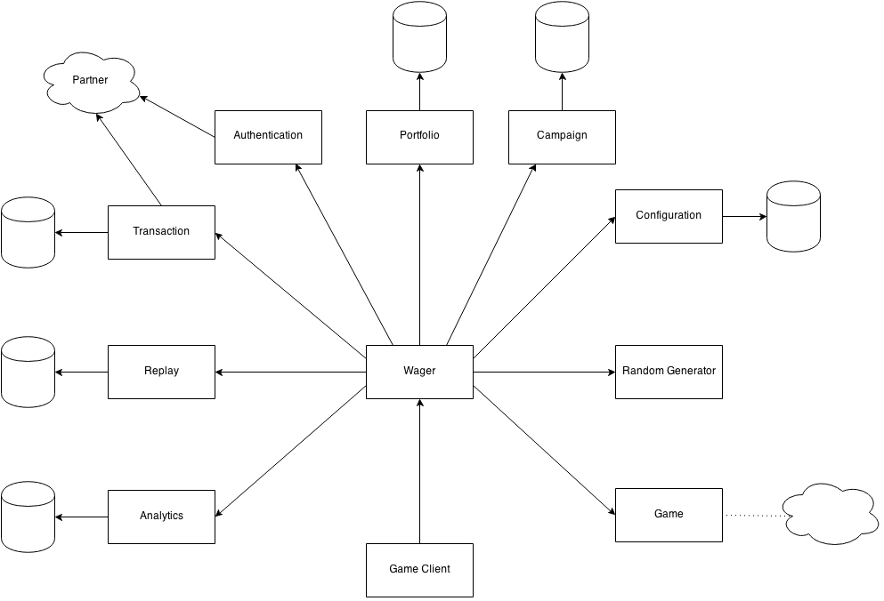

### Services
##### Wager Service
The wager service is the main hub. It delegates implementation to the different "sub-services".

> TODO: The wager service should probably generate a request id that can be used for idempontence around the system.

##### Authentication Service
The authentications service makes sure that the player is the player that hes saying he is.

> TODO: The Authentication service talks to the partner and will need to be able to propagate data from the partner to the client side partner integration.

> TODO: Should it really be the responsibility of the transaction service to propagate data from the partner or should that be something elses problem. Maybe there should be some kind of messagehub that the client can pull partner data from after an authentication?


##### Configuration Service

> TODO: There should be a configuration service. I'm not sure why this should exist but it seemed good at the time. Maybe the config service is just a front end for setting configs in the different services and that it isn't really something that is part of the wager flow. What is the difference between this and the backoffice service?

##### Backoffice Service

> TODO: There should be a configuration service. The backoffice servivce should probably be a lot of different services that can pull data out of different databases etc.

##### Game Service
The Game service is actually one game service per game implementation. It must implement an API that is common for all the games. That API is basically requiring that the game can say how much a wager request will cost and how much it will reward.
The game service doesn't have a notion of money or currency. It is just given a seed and a game data.
From that it should calculate the cost and the result in an integer.
It will also return a map of metadata.
Things in the metadata could for example be `number_of_cherries: 5` or `bonus_spins_won: 2`.
That data can then be used by the Analytics service to be able to mine behavioural data and by the Campaign service to give extra bonuses that is outside the game.
The Game service can delegate to other subservices or implement persistance with a database. That is up to the game entirely.

> TODO: How to handle bonus games. Is that just another game that is free to play if you have a ticket or something? Can the partner intergrations usually handle zero sum bets? Will that be another transaction in that case? Is this just something that makes everything overly complex? Should it have any relation to the base game where it was won? Maybe it should be that at least for the reporting and so that it is possible to see the payout percentage and so on. One good thing could be that it would be possible to share bonus games between different base games.

##### Campaign Service
The Campaign services responsibility is to keep track of running campaign. It has the ability to give discounts and bonuses on wagers. A discount could be given when there is free games campaigns. A bonus can be given for example when the user spins her 1000:nd spin.

> TODO: The campaign service should probably be a lot of different smaller services. One for each type of campaign.

##### Portfolio Service
The Portfolio service keeps track of the partners, users and devices game portfolio. Some games can be activated only for a subset of users, partners or devices of thereof.
> TODO: Should it also generate urls to the launching page? Should it take care of partner specific urls and modify them and forward to our url? Stuff like gamecode mapping and so on?

##### Analytics Service
The Analytics service gather data both about the behaviour of different users and performance of the system.
It can be implemented as a proxy for other 3:rd party products such as Google Analytics and New Relic.

> TODO: Is it a good idea to use a graph database like neo4j for this instead of using a 3:rd party service like Google Analytics?

##### Transaction Service
The transaction service takes care of the transaction and is the one that is doing reconciliation.
It should be called early on in the process.

##### Random Generator Service
The Random Generator service only responisility is to provide evenly distributed random numbers.

> TODO: Maybe the game should talk to the random number generator service directly. But we want as many services as possible to be idempotent and stateless. One way could be that we get a seed that the game then can use in the rest of the random calls. That seed needs to be really big I guess.
If the games and so on can request the size of the random number then the random number generator can generate that in a go. Is that ok for regulation? Will it be possible to get enough entropy in that or do we need background cycling in while the number is generated?

##### Replay Service
The replay service stores replays of wagers. It does this basically by storing the full request and response by the client so that can be replayed later. It also keeps track of whitch wagers results that has been seen by the user.
The Replay service privides an interface for the game client to list and get old wagers

> TODO: There should also be a way to report the progress of the replay. So when the game is running on the client it can store what boxes that was opened in a pick and click game and what freespins that has already been seen etc. That data is really only for show so that can be stored on the side. It should not have anything to do with the outcome.


###Doing a Wager

> TODO: Describe this now when everything has changed
	


###WagerService.wager()

The game client does one request to the wager service.
The wager service will in turn proxy the information to the sub-services in the correct order.
The `partner` field is for partner specific data in both the request and the reponse.
The `campaigns` field is storing informations for campaigns the wager should participate in.
The `game` field will be proxied to the `Game service`.

> TODO: How do we handle bonus games? Should there be something like tokens that can be used to play bonus games as a separate entity in the graph? Do We put it as a separate service but one that is called directly by the game and then include the response in the response of the wager? It can also be something separate. See other thoughts spread around this document.

######REQUEST
```
{
  "gamecode": "somegame",
  "credentials":
  {
	"acccount_id": "ABCDEF1234",
    "ticket": "ABCDEF1234",
    "partner": "somepartner",
    "currency": "EUR"
  },
  "retry": 0,
  "game": {
    "bet_units": 1234,
    "bet_per_unit": 1234
  },
  "campaign": {
    "ABC123": {
      "...": "..."
    },
    "BCD234": {
      "...": "..."
    }
  },
  "partner": {
    "bwin": {
      "ticket": "ABCD1234"
    }
  }
}
```
######RESPONSE
```
{
  "bet": 12345,
  "win": 12345,
  "balance": 12345,
  "currency" : "EUR",
  "transaction_id": "ABCDEFG1234567"
  "game": {
    "stoppositions": [1,2,3,4,5],
    "bonus_freespins": [
      [1,2,3,4,5],
      [1,2,3,4,5],
      [1,2,3,4,5]
    ]
  },
  "campaign": {
    "ABC123": {
      "...": "..."
    }
  },
  "partner": {
    "bwin": {
      "transationid": "12345",
      "...": "..."
    }
  }
}
```

###AuthenticationService.authenticate()

######REQUEST
```
{
  "partner": "somepartner",
  "account": "ABCDEF1234",
  "ticket": "ABCDEF1234",
  "currency": "EUR"
}
```
######RESPONSE
```
{
  "player": "ABCDEF1234"
}
```

###PortfolioService.canPlayGame()

######REQUEST
```
{
  "partner": "somepartner",
  "game": "somegame",
  "currency": "EUR",
  "player": "ABCDEF1234"
}
```
######RESPONSE
```
{
  "can_play": true
}
```

###GameService.getCost()

> TODO: Should the game service also respond with a hash of the request? That can then be compared to the has returned by the getResult() function. That way the Wager service could verify that it is the same wager that the game service is calculating the cost and the result of. This would minimy the risk of the system tampering with results. The transaction service could also generate a hash that would be included in the game services hash.
I'm looking for a way to "commit" the wager without knowing the result when the cost is calculated.

> TODO: One way of doing it is that the cost should also contain required bits of entropy. That can then be taken from the random generator.

> TODO: Some campaigns can require to know the percentage of max bet. Should that be a field in the response or is that instead in the meta data field.


######REQUEST
```
{
  "request": "abcd1234",
  "data": "{game data ...}"
}
```
######RESPONSE
```
{
  "cost": 12345,
  "required_entropy_bits": 512
}
```

###GameService.getResult()

######REQUEST
```
{
  "request": "abcd1234",
  "random": "ABCDEFGHIJKLMNOPQRSTUVXYS0123456789",
  "data": "{game data ...}"
}
```
######RESPONSE
```
{
  "result": 12345,
  "data": "{game data ...}"
  "metadata": {metadata...}
}
```

###RandomGeneratorService.getRandomSeed()

######REQUEST
```
{
  "request": "abcd1234",
  "entropy_bits": 512
}
```
######RESPONSE
```
{
 "random": "ABCDEFGHIJKLMNOPQRSTUVXYS0123456789"
}
```

###CampaignService.applyCampaigns()

> TODO: Does this also need a random. Probably, at least in the case for jackpots etc. If that is the case then we'll need the request for random bits as well and that makes it another jump. Probably that will not work as good since the campaign service might not be abe to be idempotent. I don't know.

> TODO: The names are not good. change them to something better


######REQUEST
```
{
  "request": "abcd1234",
  "partner": "somepartner",
  "game": "somegame",
  "player": "abcd1234",
  "data": "{campaign data ...}",
  "cost": 12345,
  "win": 12345,
  "meta": "{meta from GameService.getResult response ...}"
}
```
######RESPONSE
```
{
  "request": "abcd1234",
  "extra_win": 12345,
  "data": "{campaign data ...}"
}
```

###CampaignService.getDiscount()

######REQUEST
```
{
  "request": "abcd1234",
  "partner": "somepartner",
  "game": "somegame",
  "player": "abcd1234",
  "data": "{campaign data ...}",
  "cost": 12345
}
```
######RESPONSE
```
{
  "discount": 12345,
  "data": "{campaign data ...}"
}
```

###TransactionService.placeWager()

######REQUEST
```
{
  "request": "abcd1234",
  "partner": "somepartner",
  "player": "ABCDEF1234",
  "account": "ABCDEF1234",
  "ticket": "ABCDEF1234",
  "game": "somegame",
  "currency": "EUR",
  "amount": 12345
}
```
######RESPONSE
```
{
  "transaction": "ABCDEF1234",
  "seed": "123456789"
}
```

###TransactionService.completeWager()

######REQUEST
```
{
  "request": "abcd1234",
  "transaction": "ABCDEF1234",
  "partner": "somepartner",
  "player": "ABCDEF1234",
  "account": "ABCDEF1234",
  "ticket": "ABCDEF1234",
  "game": "somegame",
  "currency": "EUR",
  "amount": 12345
}
```
######RESPONSE

> TODO: Should this really carry the balance or should that be a separate request? This is just cramming data that is not part of this really.

```
{
  "balance": 12345,
  "currency": "EUR"
}
```

###ReplayService.storeWager()

######REQUEST
```
{
  "request": "abcd1234",
  "player": "abcd1234",
  "client_request": "{client request ...}",
  "client_response": "{client response ...}"
}
```
> TODO: Do we get back some kind of ID here that the client can use to send progress data to?

######RESPONSE
```
{
}
```

###AnalyticsService.track()

######REQUEST
```
{
  "request": "abcd1234",
  "partner": "somepartner",
  "player": "abcd1234",
  "bet": 12345,
  "win": 12345,
  "meta": "{meta from GameService.GetResult response ...}",
  "timings": {
    "autheticate": 12345,
    "can_play_game": 12345,
    "...": "..."
  }
}
```
######RESPONSE
```
{
}
```


